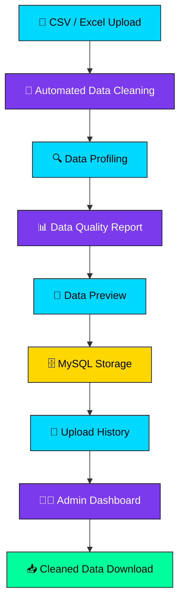
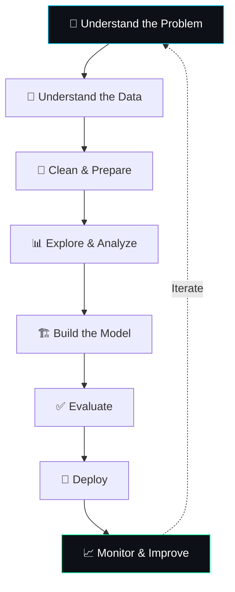

```mermaid
flowchart LR
    A[🗃️ Data] --> B[🧹 Data Cleaning]
    B --> C[📊 Data Analysis]
    C --> D[🤖 Machine Learning]
    D --> E[🧠 Deep Learning]
    E --> F[💬 NLP / LLM / GenAI]
    F --> G[🚀 AI Solutions]

    style A fill:#0D1117,stroke:#00D9FF,color:#fff
    style B fill:#0D1117,stroke:#7C3AED,color:#fff
    style C fill:#0D1117,stroke:#00D9FF,color:#fff
    style D fill:#0D1117,stroke:#7C3AED,color:#fff
    style E fill:#0D1117,stroke:#FFD700,color:#fff
    style F fill:#0D1117,stroke:#FF6B6B,color:#fff
    style G fill:#0D1117,stroke:#00FF9C,color:#fff
```

<!-- ========================================================= -->
<!--                    3D PROFILE HEADER                      -->
<!-- ========================================================= -->

<div align="center">


<br>

<a href="https://github.com/anuj931270">

</a>
<a href="https://github.com/anuj931270">

</a>


<br><br>


</div>


<!-- ========================================================= -->
<!--                     ABOUT ME - 3D CARD                     -->
<!-- ========================================================= -->

<div align="center">

</div>

<table>
<tr>
<td width="55%" valign="top">

```yaml
anuj_pathak:
  role: "AI Engineer / Data Scientist"
  experience: "2+ years professional"
  mission: >
    Transform raw data into intelligent,
    real-world AI solutions

  core_strengths:
    - Python, SQL & Machine Learning foundations
    - Data Analysis, EDA & Visualization
    - AI-powered apps via FastAPI & Streamlit
    - Deep Learning, NLP, LLMs & GenAI (exploring)
    - Real-world business problem solving

  currently: "Leveling up in Deep Learning & GenAI 🚀"
  fun_fact: "I turn messy CSVs into clean insights ✨"
```

</td>

<td width="45%" align="center">


</td>
</tr>
</table>

<div align="center">

</div>

---

<!-- ========================================================= -->
<!--                    TROPHIES / ACHIEVEMENTS                 -->
<!-- ========================================================= -->

<div align="center">


</div>

---

## ⚡ Professional Profile

<div align="center">

<table>
<tr><th>🎯 Area</th><th>💡 Expertise</th></tr>
<tr><td>🤖 Artificial Intelligence</td><td>AI Applications & Intelligent Systems</td></tr>
<tr><td>📊 Data Science</td><td>Data Analysis, EDA & Business Insights</td></tr>
<tr><td>🧠 Machine Learning</td><td>Classification, Regression & Clustering</td></tr>
<tr><td>🧬 Deep Learning</td><td>Neural Networks & Deep Learning Concepts</td></tr>
<tr><td>💬 NLP</td><td>Text Processing, NLP Pipelines & RNN</td></tr>
<tr><td>⚙️ Backend</td><td>FastAPI, REST APIs & Python</td></tr>
<tr><td>📈 Visualization</td><td>Matplotlib, Seaborn & Plotly</td></tr>
<tr><td>🚀 Deployment</td><td>Streamlit & API-based Applications</td></tr>
</table>

</div>

---

<!-- ========================================================= -->
<!--                    TECH STACK - 3D ICONS                   -->
<!-- ========================================================= -->

<div align="center">

</div>

<div align="center">

### 🐍 Programming & Data


### 🤖 AI / Machine Learning


### ⚡ Backend & Application Development


### 🗄️ Database & Tools


### 📊 Data Visualization


</div>

---

<!-- ========================================================= -->
<!--              SKILL PROGRESS BARS (3D STYLE)                -->
<!-- ========================================================= -->

<div align="center">

</div>

<div align="center">

**Python**


**Machine Learning**


**SQL & Data Analysis**


**FastAPI / Deployment**


**Deep Learning**


**NLP**


**Generative AI / LLMs**


</div>

---

## 🧠 AI & Machine Learning Expertise

<div align="center">

<table>
<tr>
<td align="center" width="25%">

### 📊 Data Science
EDA · Data Cleaning
Feature Engineering
Feature Selection
Data Visualization
Statistical Analysis

</td>
<td align="center" width="25%">

### 🤖 Machine Learning
Linear/Logistic Regression
KNN · Decision Tree
Random Forest
XGBoost · AdaBoost

</td>
<td align="center" width="25%">

### 🔍 Unsupervised ML
K-Means · DBSCAN
Hierarchical Clustering
Agglomerative Clustering
Dendrogram · Silhouette Score

</td>
<td align="center" width="25%">

### 🧠 AI / Deep Learning
Neural Networks · Perceptron
RNN · NLP
LLMs · Generative AI
AI Applications

</td>
</tr>
</table>

</div>

---

<!-- ========================================================= -->
<!--                   FEATURED PROJECT - 3D                    -->
<!-- ========================================================= -->

<div align="center">


**`AI-Powered Data Processing & Management Platform`**

</div>

A complete data processing platform designed to automate the journey from **raw client data → cleaned data → database → insights**.

<div align="center">



</div>

### 🛠️ Project Technologies

<div align="center">

`Python` • `FastAPI` • `Flask` • `Pandas` • `MySQL` • `Tailwind CSS`

</div>

### ✨ Project Highlights

<table>
<tr>
<td>

- 📤 CSV & Excel file processing
- 🧹 Automatic missing-value handling
- 🔄 Duplicate detection & removal
- 🔍 Automatic data profiling
- 📊 Data quality reporting
- 👀 Cleaned data preview
- 🗄️ MySQL database integration

</td>
<td>

- 📜 Upload history tracking
- 👨‍💼 Admin authentication
- 🗑️ Admin-only file deletion
- 📥 Cleaned CSV download
- 🎨 Responsive dashboard UI
- 🔐 Environment-based configuration
- ⚡ Fast, automated pipeline

</td>
</tr>
</table>

---

<!-- ========================================================= -->
<!--              DEVELOPMENT JOURNEY - MERMAID 3D              -->
<!-- ========================================================= -->

<div align="center">

</div>



---

<!-- ========================================================= -->
<!--                   CONTRIBUTION SNAKE                       -->
<!-- ========================================================= -->

<div align="center">


<sub>⚙️ Powered by <a href="https://github.com/Platane/snk">Platane/snk</a> — auto-generated via GitHub Actions</sub>

</div>

---

# 📊 GitHub Analytics

<div align="center">


<br><br>


<br><br>


</div>

---

# 🏆 What I Bring

<div align="center">

<table>
<tr>
<td align="center">🐍<br><b>Python</b><br>⭐⭐⭐⭐⭐</td>
<td align="center">📊<br><b>Data Science</b><br>⭐⭐⭐⭐⭐</td>
<td align="center">🤖<br><b>ML</b><br>⭐⭐⭐⭐⭐</td>
<td align="center">⚡<br><b>FastAPI</b><br>⭐⭐⭐⭐☆</td>
<td align="center">🗄️<br><b>SQL</b><br>⭐⭐⭐⭐⭐</td>
</tr>
<tr>
<td align="center">🧠<br><b>Deep Learning</b><br>⭐⭐⭐☆☆</td>
<td align="center">💬<br><b>NLP</b><br>⭐⭐⭐☆☆</td>
<td align="center">✨<br><b>GenAI</b><br>⭐⭐☆☆☆</td>
<td align="center">📈<br><b>Visualization</b><br>⭐⭐⭐⭐⭐</td>
<td align="center">🚀<br><b>Deployment</b><br>⭐⭐⭐⭐☆</td>
</tr>
</table>

</div>

---

# 💡 My Engineering Philosophy

<div align="center">

> ### 💎 "Don't just build models. Build solutions that solve real problems."



</div>

---

# 🎯 Current Focus

<div align="center">


<br>


</div>

---

<!-- ========================================================= -->
<!--                    RANDOM DEV QUOTE                        -->
<!-- ========================================================= -->

<div align="center">

### 💬 Quote of the Moment


</div>

---

<!-- ========================================================= -->
<!--                    CONNECT - 3D FOOTER                      -->
<!-- ========================================================= -->

<div align="center">

</div>

<div align="center">

<a href="https://github.com/anuj931270">

</a>
<a href="https://www.linkedin.com/in/anuj-kumar6702">

</a>
<a href="mailto:your-email@example.com">

</a>

<br><br>

### 🚀 Building • Learning • Improving • Creating


</div>
